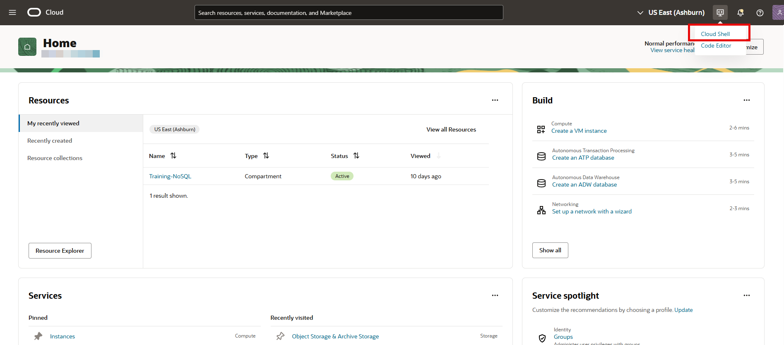
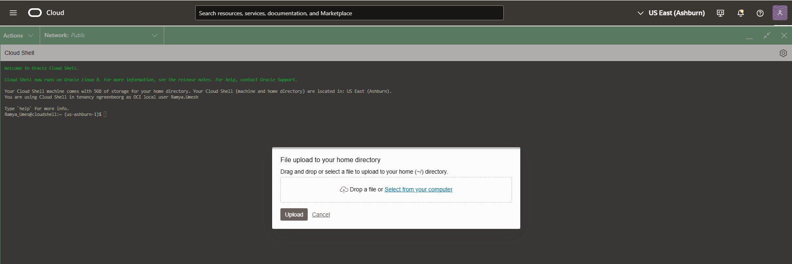

# Download Migrator Utility and Upload to Cloud Shell

## Introduction

This lab walks you through the steps to download Oracle NoSQL Migrator utility, launch a Cloud Shell for an Oracle Cloud user account, and upload the Migrator utility to Cloud Shell.

Estimated Lab Time: 5 minutes

### Objectives

In this lab you will:
* Download Oracle NoSQL Migrator utility.
* Launch the Cloud Shell for an Oracle Cloud user account.
* Upload the Oracle NoSQL Migrator utility to the Cloud Shell.

### Prerequisites

*  An Oracle Free Tier, Always Free, Paid or LiveLabs Cloud Account

## Step 1: Download the Oracle NoSQL Migrator Utility

1. Open the **[Oracle NoSQL Downloads page](https://www.oracle.com/database/technologies/nosql-database-server-downloads.html)** and scroll down to Oracle NoSQL Database Migrator and Analytics Integrator section.

    

2. Click the latest Oracle NoSQL Migrator package. Here, you will use **nosql-migrator-1.7.0**. This will navigate to Oracle Software Delivery Cloud page.

3. Accept the terms and conditions.

4. Download the Oracle NoSQL Migrator package to your local machine. Here you will use **V1048015-01.zip**.

## Step 2: Upload Oracle NoSQL Migrator Utility to the Cloud Shell

1. Launch the Cloud Shell from the **Developer tools** menu on your Oracle Cloud console. The web browser opens your home directory. See **Get Started** lab for detailed steps to access the Oracle Cloud Console.

    

2. Click the menu option on the upper right corner of the Cloud Shell window and select the **upload** option from the drop-down menu.

    

3. In the pop-up window, either drag and drop the Oracle NoSQL Database Migrator package from your local machine, or click the *Select from your computer* option, select the package from your local machine, and click the **Upload** button.

    

4. Extract the contents of the package using the appropriate command. For example,

    ```
    <copy>unzip -q V1048015-01.zip</copy>
    ```

9. The resulting folder contains the Oracle NoSQL Migrator utility.

You may proceed to the next lab.

## Learn More

* [Cloud Shell](https://docs.oracle.com/en-us/iaas/Content/API/Concepts/cloudshellintro.htm)

## Acknowledgements
* **Author** - Ramya Umesh, Principal UA Developer, DB OnPrem Tech Svcs & User Assistance
* **Last Updated By/Date** - Ramya Umesh, Principal UA Developer, DB OnPrem Tech Svcs & User Assistance, August 2025
