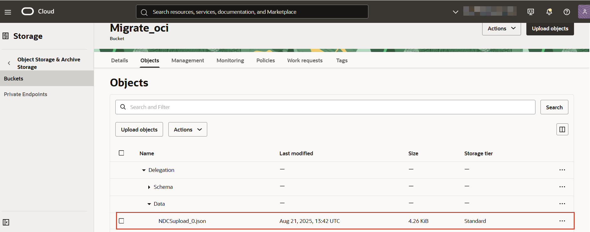
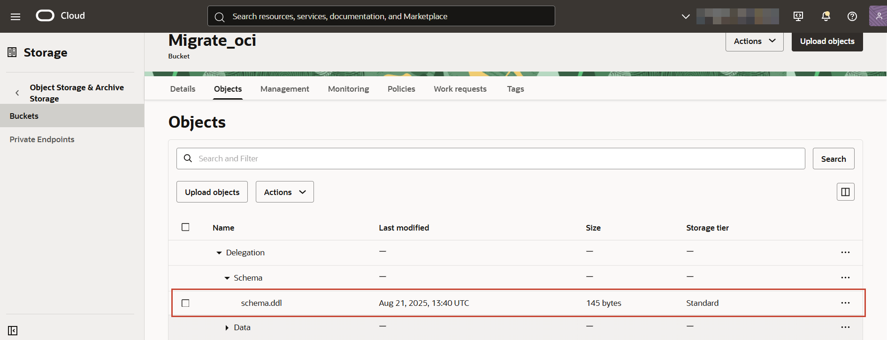

# Run the Oracle NoSQL Database Migrator Utility

## Introduction

The Oracle NoSQL Database Migrator utility acts as a connector between the data source and the sink. This utility exports data from the selected source and imports that data into the sink. You can migrate a single table in a single migration task. 

This lab walks you through the steps to run the Migrator utility and view the copied files. 

Estimated Lab Time: 5 Minutes

### Objectives

In this lab you will:
* Run the Migrator utility. 
* View the migrated data in the OCI Object Storage Bucket.

### Prerequisites

*  An Oracle Free Tier, Always Free, Paid or LiveLabs Cloud Account
*  Migrator configuration file created in **Lab 2 - Create a Configuration File**.

## Step 1: Run the Oracle NoSQL Database Migrator utility

1. From the Cloud Shell, navigate to the directory where you extracted the NoSQL Database Migrator utility.

    ```
    <copy>cd V1048015-01/nosql-migrator-1.7.0</copy>
    ```

2. Run the runMigrator command by passing the configuration file created in **Lab 2 - Create a Configuration File**.

    ```
    <copy>
    ./runMigrator --config ./migrator-config.json
    </copy>    
    ```

    The NoSQL Database Migrator utility proceeds with the data migration activity. It copies the table data as JSON files and the table schema as a DDL file to the OCI Object Storage bucket. The NoSQL Database Migrator utility displays the progress and status of migration activity on the CLI:

     ```
    <copy>
    [INFO] creating source from given configuration:
    [INFO] source creation completed
    [INFO] creating sink from given configuration:
    [INFO] sink creation completed
    [INFO] creating migrator pipeline
    [INFO] migration started
    [INFO] [OCI OS sink] : writing table schema to Delegation/Schema/schema.ddl
    [INFO] [OCI OS sink] : start writing records with prefix Delegation
    [INFO] migration completed.
    Records provided by source=4,Records written to sink=4,Records failed=0.
    Elapsed time: 0min 0sec 486ms
    Migration completed.
    </copy>
    ```

## Step 2: View migrated data in OCI Object Storage Bucket

1. Log in to the Oracle Cloud console.
2. From the Navigation menu, select **Storage > Object Storage & Archive Storage > Buckets**.
3. Select your compartment and then select the **Migrate_oci** bucket.
4. On the **Objects** tab, you can view the exported data in the **Delegation/Data** directory.

  

5. You can view the exported table schema in the **Delegation/Schema** directory.

  
 
Congratulations! You have completed the workshop.

## Acknowledgements
* **Author** - Ramya Umesh, Principal UA Developer, DB OnPrem Tech Svcs & User Assistance
* **Last Updated By/Date** - Ramya Umesh, Principal UA Developer, DB OnPrem Tech Svcs & User Assistance, August 2025
